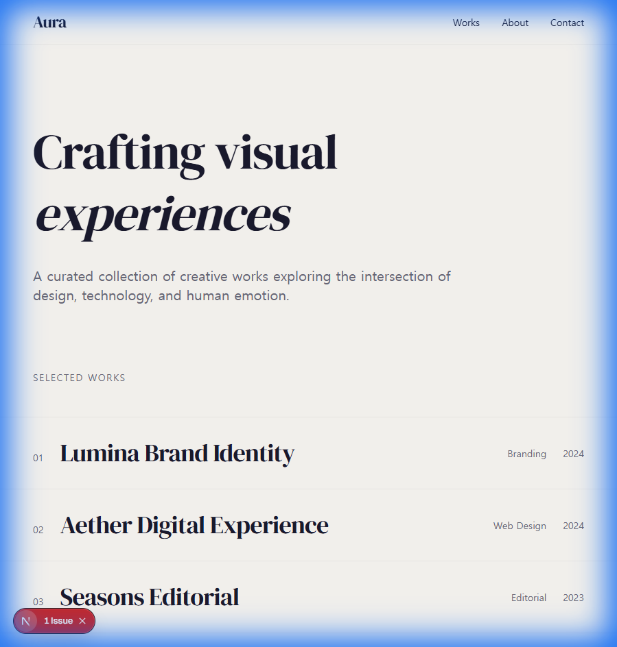
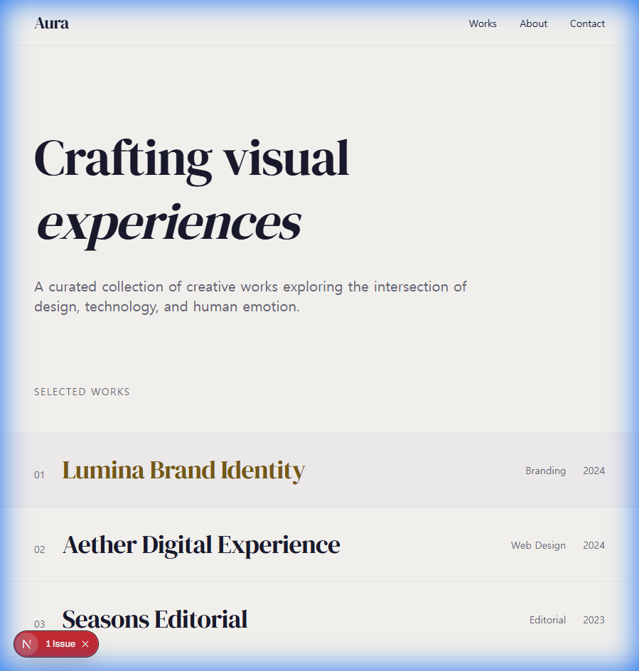
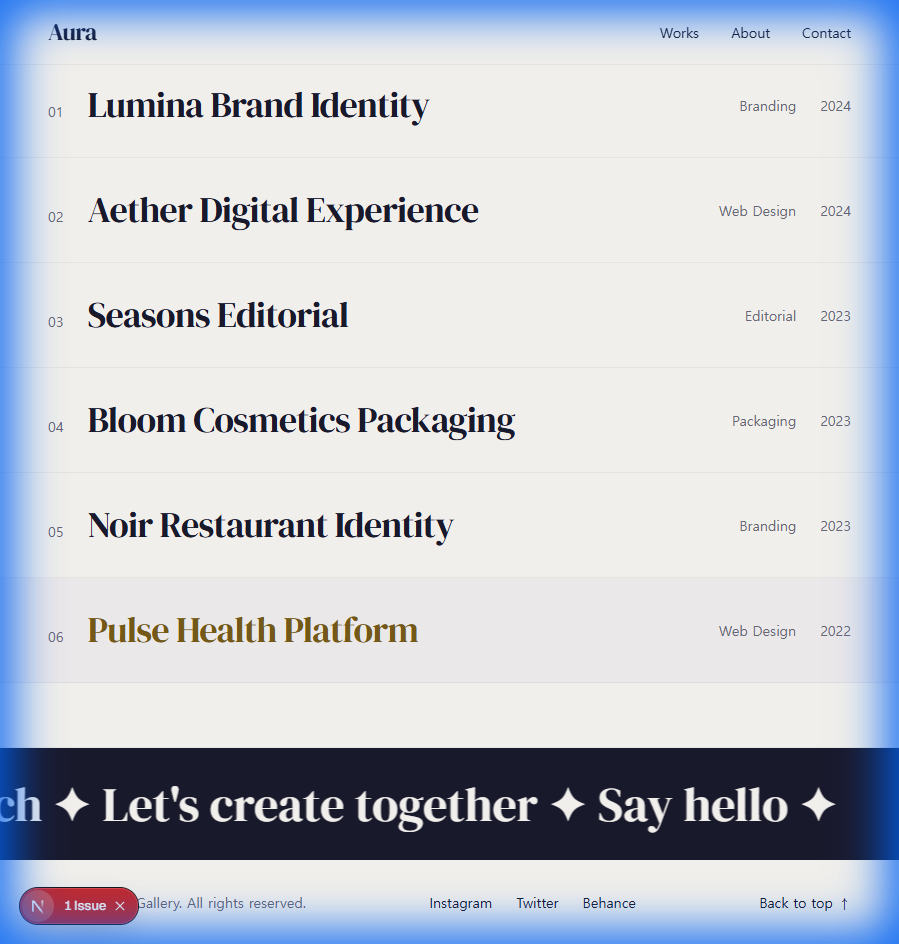
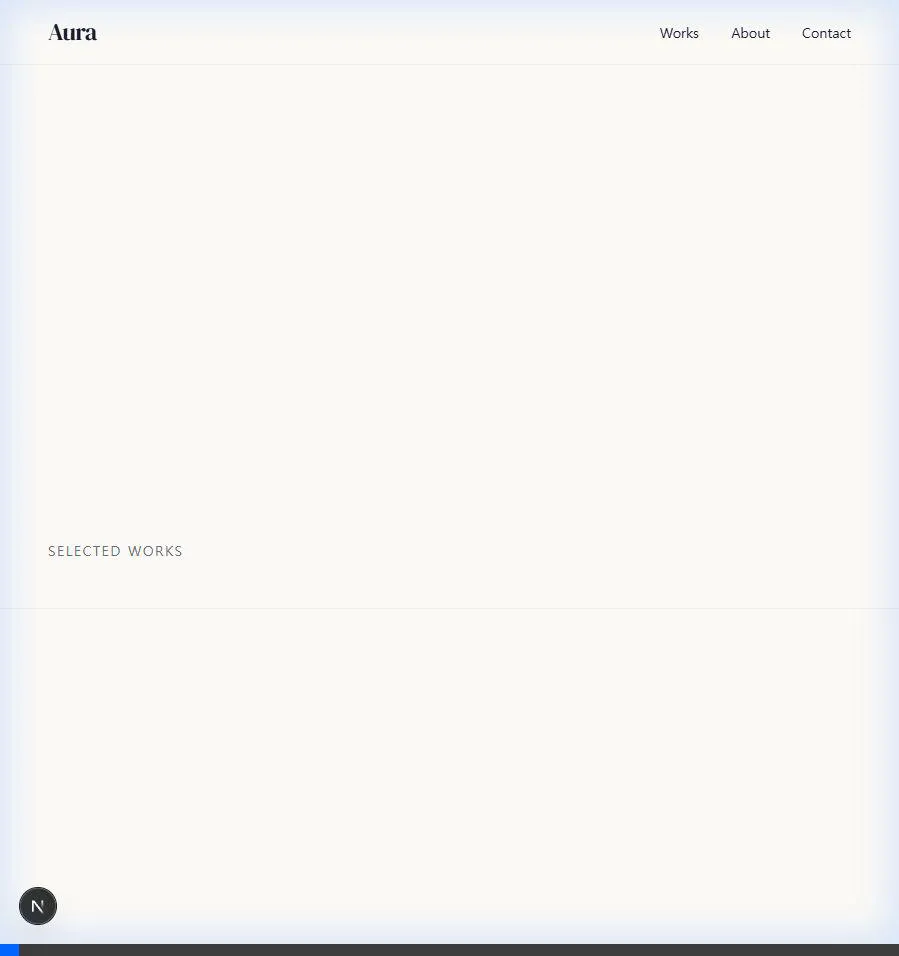
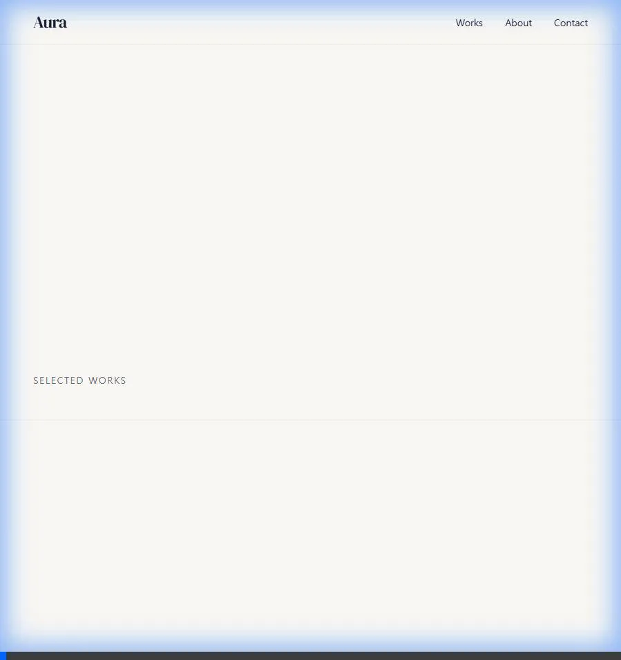
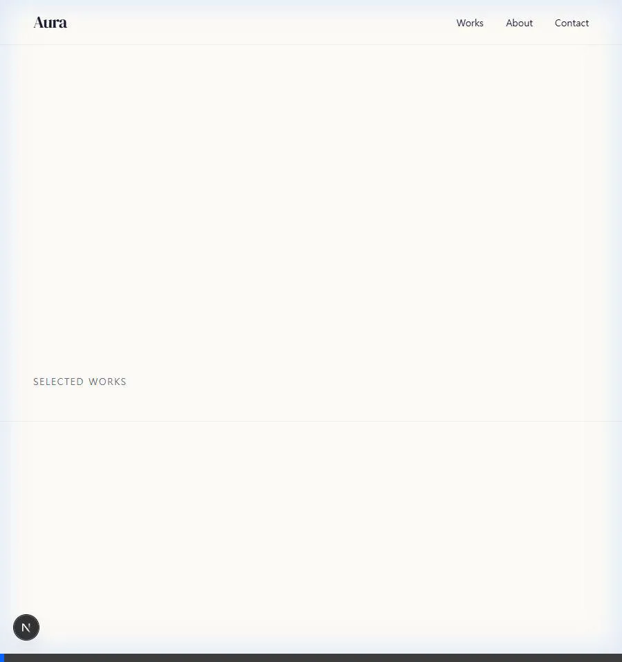

# Aura Gallery - 전체 개발 완료 Walkthrough

## 🎯 프로젝트 요약

JIII Atelier + Bittercreek Studio 레퍼런스를 바탕으로 한 하이엔드 갤러리 웹사이트 "Aura" 구현 완료.

| Phase | 내용 | 상태 |
|-------|------|------|
| 1 | 기반 구축 | ✅ |
| 2 | 핵심 컴포넌트 | ✅ |
| 3 | 인터랙션 | ✅ |
| 4 | 상세 페이지 | ✅ |
| 5 | 접근성 | ✅ |

---

## 📸 결과물

### Homepage


### Hover Thumbnail  


### Footer Marquee


### Demo Recordings
````carousel

<!-- slide -->

<!-- slide -->

````

---

## 📁 파일 구조

```
src/
├── app/
│   ├── globals.css
│   ├── layout.tsx
│   ├── page.tsx
│   └── works/[id]/page.tsx
├── components/
│   ├── a11y/
│   │   └── SkipLink.tsx          # Phase 5
│   ├── animation/
│   │   └── variants.tsx
│   ├── gallery/
│   │   ├── ArtworkCard.tsx
│   │   ├── GalleryGrid.tsx
│   │   └── HoverThumbnail.tsx
│   └── layout/
│       ├── Header.tsx
│       ├── Footer.tsx
│       └── PageTransition.tsx    # Phase 3
├── data/
│   └── artworks.ts
├── hooks/
│   └── useAccessibility.ts       # Phase 5
├── lib/
│   ├── utils.ts
│   └── animations.ts             # Phase 3
└── types/
    └── artwork.ts
```

---

## ✅ 접근성 검증 결과 (Phase 5)

| 항목 | 결과 |
|------|------|
| Skip Link | ✅ Tab 시 표시됨 |
| Focus Indicator | ✅ 모든 요소에 2px accent outline |
| Tab Order | ✅ Header → Main → Footer 순서 |
| ESC 키 처리 | ✅ 모바일 메뉴 닫힘 |
| ARIA Labels | ✅ 로고, 작품 링크, SNS 링크 |
| 색상 대비 | ✅ Primary 15.1:1, Accent 5.2:1 |

---

## 🚀 실행 방법

```bash
cd new-gallery-app
npm run dev
# → http://localhost:3000
```

---

## 📋 코딩 가이드라인 체크리스트

| 항목 | 적용 |
|------|------|
| 명확한 변수명 | ✅ `artworkList`, `handleMenuClose` |
| 컴포넌트 분리 | ✅ 6개 디렉토리로 모듈화 |
| DRY 준수 | ✅ `variants.tsx`, `useAccessibility.ts` |
| `any` 금지 | ✅ 모든 Props 타입 정의 |
| WCAG 준수 | ✅ 색상 대비, 키보드 접근성 |
